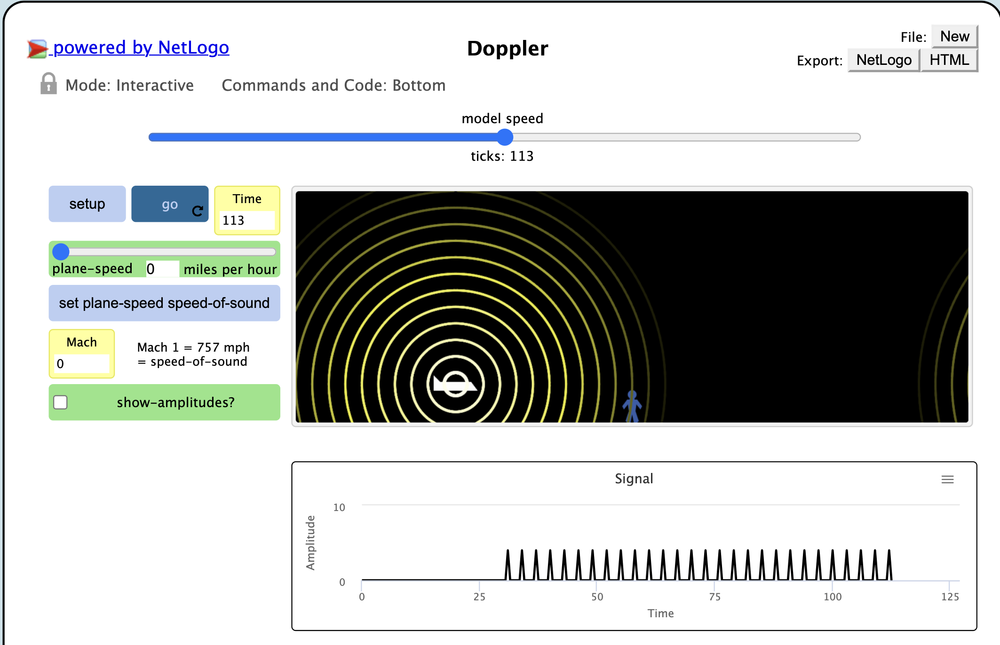

## Імітаційне моделювання комп'ютерних систем
## СПм-21-2, **Сергєєв Данило Андрійович**
### Лабораторная работа №**1**. Описание имитационных моделей

 

### Выбранная модель в среде NetLogo:
[Doppler](http://www.netlogoweb.org/launch#http://www.netlogoweb.org/assets/modelslib/Sample%20Models/Chemistry%20&%20Physics/Waves/Unverified/Doppler.nlogo)

 

### Вербальное описание модели:
Doppler - эта модель демонстрирует эффект Доплера, видимое изменение частоты волны, излучаемой источником, движущимся относительно наблюдателя.
В этой модели самолет летит над наблюдателем. Желтые кружки представляют пики звуковых волн, излучаемых самолетом.

### Управляющие параметры:
- **PLANE-SPEED** определеяет какая будет скорость самолета
- **SHOW-AMPLITUDES**  переключатель позволяет увидеть силу звуковой волны на каждом участке воздуха.

### Внутренние параметры:
- **numeratort** проход каждого расчета слева-направо и сверху-вниз
- **column-number**. определяет количество строк

### Критерии эффективности системы:
- Практический подтверждение Эффект Доплера 

### Недостатки модели:
Движется только самолет

 

## Вычислительные эксперименты
 
### 2. Проведем  эксперимент, когда самолет не будет двигаться, но будет издавать звук
Установим ползунок PLANE-SPEED на 0 миль/час
 

С левой и правой стороны от самолета волны одинаково распостраняются во все стороны.
  Это нам и подтверждает график  ампилтуды

### 2. Проведем  эксперимент, когда самолет будет двигаться со скоростью МЕНЬШЕ, чем скорость звуковой волны
Установим ползунок PLANE-SPEED на 500 миль/час
 

 
Когда самолет двигается со скоростью меньше, чем скорость звуковой волны. Видим, что волны идущие к человеку справа, короче, чем те, которые идут слева. Это и есть эффект Доплера

 
График

### 2. Проведем эксперимент с конченой и бексонечной десятичной дробью

Некоторые шаблоны останавливаются после нескольких цифр, а другие повторяются вечно

### 3. Возможно ли получить изображение шахматной доски?

Чтобы результатом была шахматная доская период дроби должен состоять из двух чисел, а его целая часть соответствовать второй цифре в периоде.
 Допустим, 0,505050(50)
 Попробуем получить эту дробь:
 0,50(50) = Х
 50,50(50) = 100Х
 50=99Х
 Х=50/99
 Проверим результат:

 Первая цифра необязательно должна быть нулем:
 1,(01)=Х
   101.(01)=100х
  100=99х
 х=100/99

### 3. Возможно ли получить вертикальные полосы?
Отрегулировав полузнок width на четное число, всегда будут получатся вертикальный полосы: 

Получить вертикальные полосы на нечетном полузнке невозможно.

### 4. Как дробь будет приближена к числу Pi?
При условиях максимального знаменателя и числителя равному 100. Ближе всех будет дробь 22/7.

Модель показывает, что практический расчет соответствовует отоброжаемому результату

