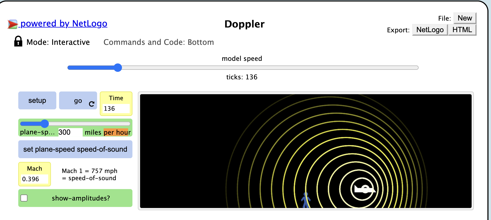
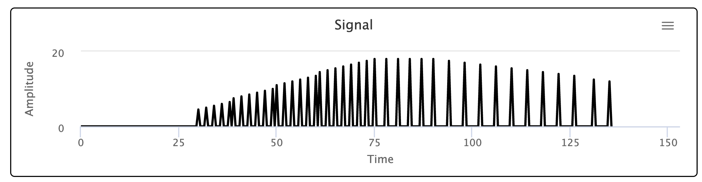
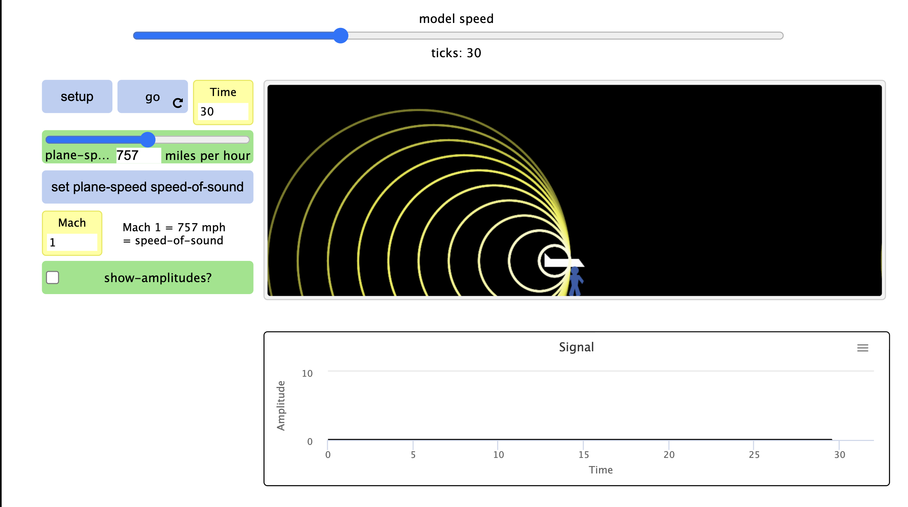
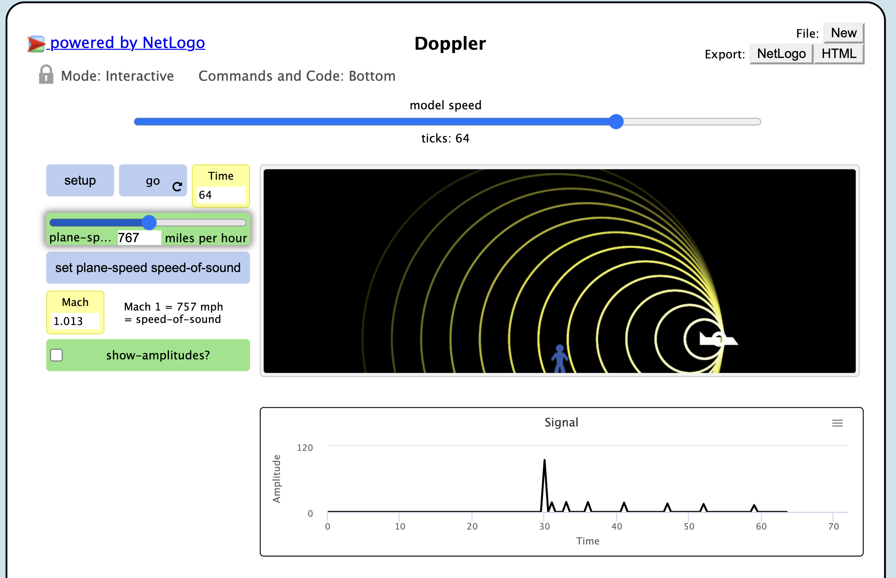
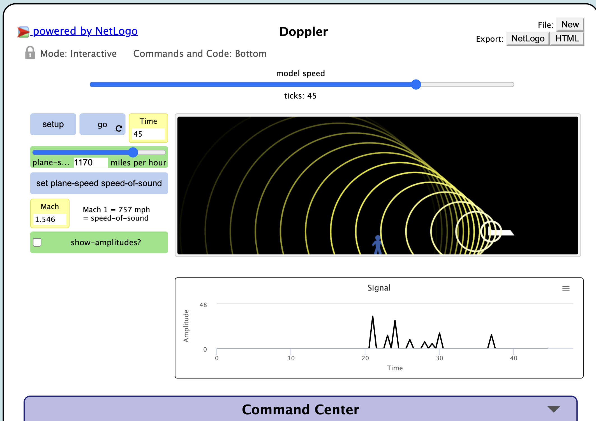

## Імітаційне моделювання комп'ютерних систем
## СПм-21-2, **Сергєєв Данило Андрійович**
### Лабораторная работа №**1**. Описание имитационных моделей

 

### Выбранная модель в среде NetLogo:
[Color Fractions](http://www.netlogoweb.org/launch#http://www.netlogoweb.org/assets/modelslib/Sample%20Models/Mathematics/Color%20Fractions.nlogo)

 

### Вербальное описание модели:
Color Fractions отображает десятичную форму дроби в виде набора цветов. Это позволяет вам исследовать, как полученные закономерности соотносятся с исходной дробью.

### Управляющие параметры:
- **numerator** определеяет какое будет делимое
- **denominator**  определеяет каким будет делитель
- **width** позволяет менять ширину отображаемой области цифр

### Внутренние параметры:
- **numeratort** проход каждого расчета слева-направо и сверху-вниз
- **column-number**. определяет количество строк

### Критерии эффективности системы:
- Практический расчет должно соответствовать отоброжаемому, корректная работа модеил 

### Недостатки модели:
Невозможно установить делимое и делитель более 100 

 

## Вычислительные эксперименты

### 1. Исследуем одну и ту же дробь. Затем увеличим и числитель, и знаменатель в одинаковое количество раз:

Одна и та же дробь дает один и тот же результат. Дробь, которую можно сократить, также дает аналогичный результат

### 2. Проведем эксперимент с конченой и бексонечной десятичной дробью

Некоторые шаблоны останавливаются после нескольких цифр, а другие повторяются вечно

### 3. Возможно ли получить изображение шахматной доски?

Чтобы результатом была шахматная доская период дроби должен состоять из двух чисел, а его целая часть соответствовать второй цифре в периоде.
 Допустим, 0,505050(50)
 Попробуем получить эту дробь:
 0,50(50) = Х
 50,50(50) = 100Х
 50=99Х
 Х=50/99
 Проверим результат:

 Первая цифра необязательно должна быть нулем:
 1,(01)=Х
   101.(01)=100х
  100=99х
 х=100/99

### 3. Возможно ли получить вертикальные полосы?
Отрегулировав полузнок width на четное число, всегда будут получатся вертикальный полосы: 

Получить вертикальные полосы на нечетном полузнке невозможно.

### 4. Как дробь будет приближена к числу Pi?
При условиях максимального знаменателя и числителя равному 100. Ближе всех будет дробь 22/7.

Модель показывает, что практический расчет соответствовует отоброжаемому результату

